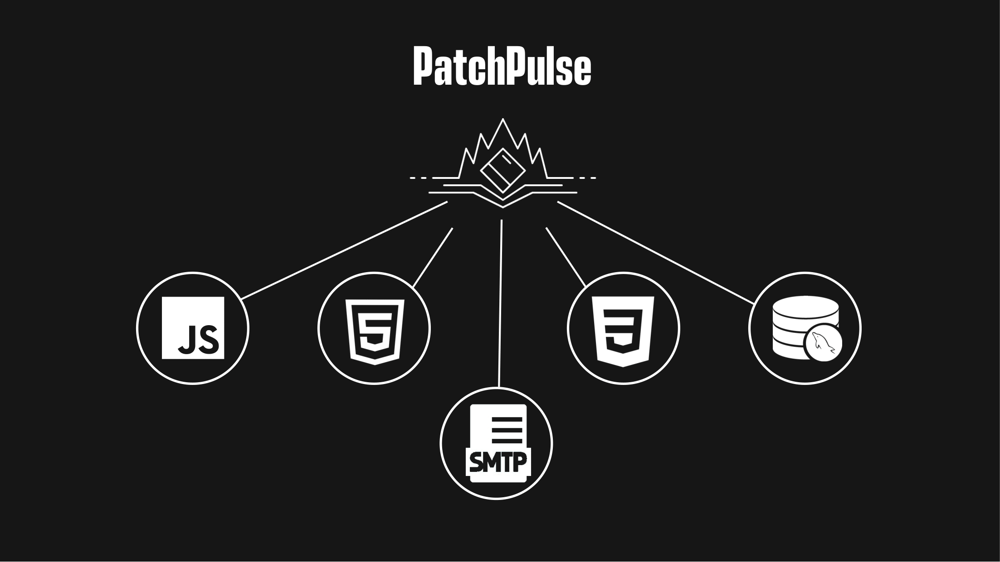
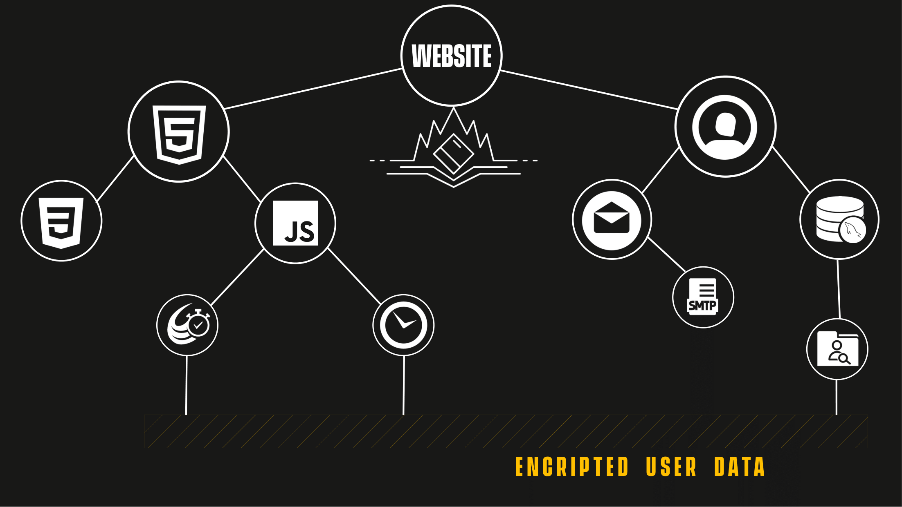
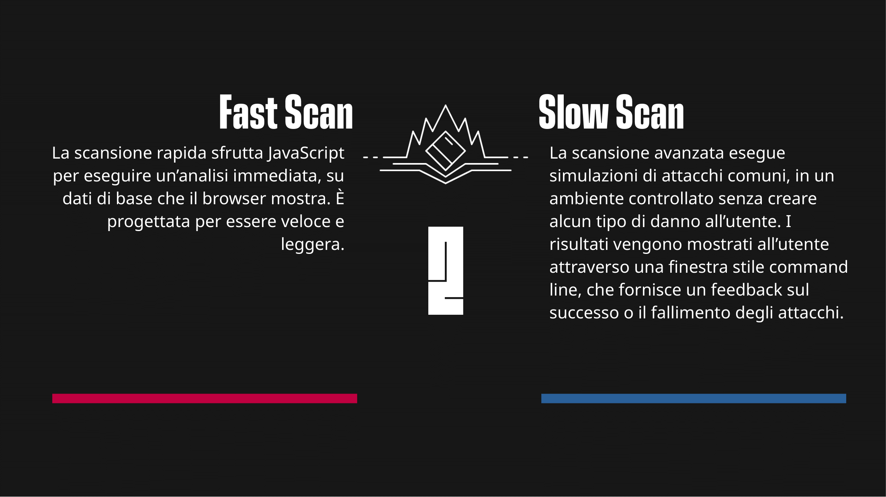
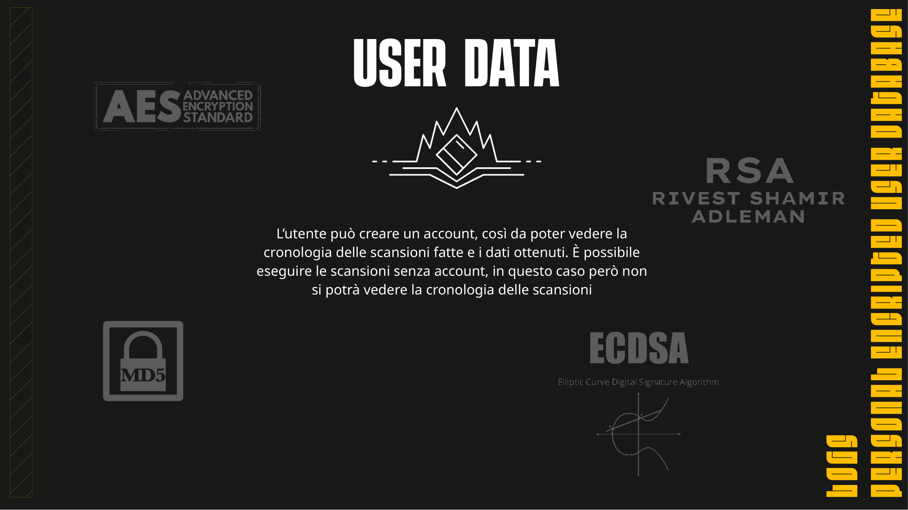
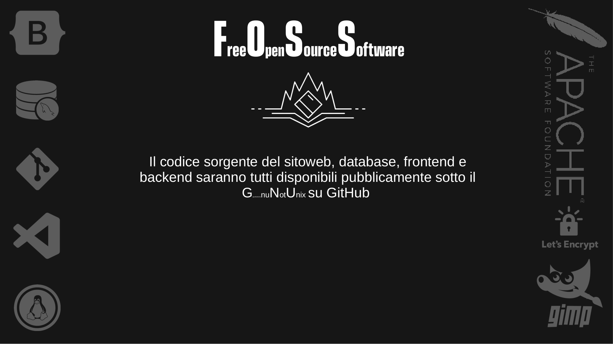
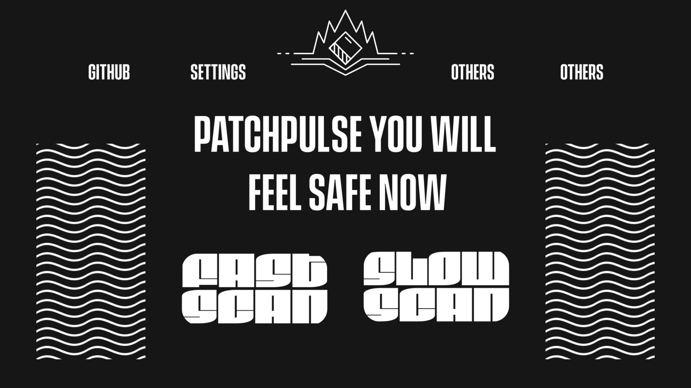

# SecurityTesting
Security Testing Site Open Source
---
- Free
- Open source
- Open to suggestions
- No ADS

You can help us by using the issue section
Thanks

## Roadmap
- [ ] Database support 
- [ ] Privacy, Term of use, software licence.
- [ ] Login support (Type of account, maxStorage, etc...)
- [ ] Better backend support
- [ ] Choosing if and what framework to use
  - [ ] [GrapeJS](https://grapesjs.com/)
  - [ ] [Pagekit](https://github.com/uatrend/pagekit)
- [X] Chosing if use [bootstrap](https://getbootstrap.com/)
- [ ] Make the webpage dynamic (Tablet, Desktops, Phones)
- [ ] Add a link to scan websites (Value it's security)

 ## Presentation
 
 
 
 
 
 
 
 

 
